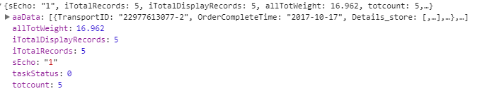
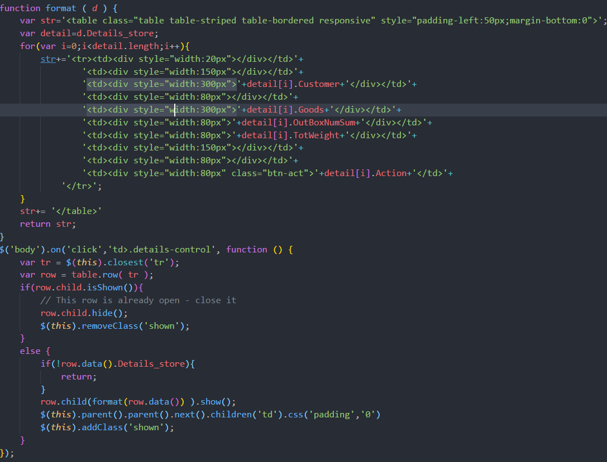

### DataTables的使用

datatables可以用来进行表格的构建，是jquery的一个插件,可以用来制作自适应的表格

`
    
    服务端分页以及数据请求的配置
    var option={
	    "dom":"lrtpi", //调整分页、搜索、以及说明信息的位置
	    "scrollX":true,     //允许表格水平出现横向滚动条(当文字内容或列比较多时)
	    "processing": true, //加载数据时的Loading状态
        "serverSide": true, //开启服务器模式
        "lengthChange":false, //禁止用户改变表格每页显示的记录数
        "bFilte":false,
        "stateSave":true,   //保存状态-在页面重新加载的时候恢复状态（页码等内容）
        "destroy": true,    //销毁表格
        "iDisplayLength":10,//修改每页展示的条数
        "sAjaxSource":"xxx.php", //请求数据地址
        "ordering":false,   //禁止Datatables开启排序
        "searching":false,  //禁止Datatables开启本地搜索
        "autoWidth":false,  //控制Datatables是否自适应宽度
        "sPaginationType": "full_numbers",  //设置分页的样式
        language:{   //进行分页样式以及Loading配置
            "processing":"

",
            "lengthMenu": "_MENU_ 条记录每页",
            "zeroRecords": "没有找到记录",
            "info": "第 _PAGE_ 页 ( 总共 _PAGES_ 页 )",
            "infoEmpty": "无记录",
            "infoFiltered": "(从 _MAX_ 条记录过滤)",
                paginate:{
                   "sFirst":"首页",
                   "sPrevious": "上页",
                   "sNext": "下页",
                   "sLast": "末页"
                }
        },
        aoColumns:[    //每一列展示的数据与返回数据的字段相对应,可以设置每一列的宽度以及类名设置                
             {"data":"DriverID","width":"100px","class":"eg"},
             {"data":"RealName","width":"100px"},
             {"data":"A","width":"100px"},
             {"data":"B","width":"100px"},
             {"data":"A","width":"100px"},
             {"data":"B","width":"100px"},
             {"data":"A","width":"100px"},
             {"data":"B","width":"100px"},
             {"data":"A","width":"100px"},
             {"data":"B","width":"100px"},
             {"data":"A","width":"100px"},
             {"data":"B","width":"100px"},
             {"data":"A","width":"100px"},
             {"data":"B","width":"100px"},
             {"data":"action","width":"100px"}	
        ],
        columnDefs: [  //进行每一列的自定义
            {
            'targets':0,
            'searchable':false,//禁止参与搜索
            'orderable':false,//禁止参与排序
            'className':'driverID',
            'render': function (data, type, full, meta){
                return full.OpenID;
                }
            },
            {
            'targets':-1,
            'searchable':false,//禁止参与搜索
            'orderable':false,//禁止参与排序
            'className': 'sd-edit',
            'render': function (data, type, full, meta){
                return '<a class="edit" data-edit="0" data-open="'+full.OpenID+'" data-id="'+full.DriverID+'" href="javascript:;">编辑</a>';
                }
            }
        ],
        "fnServerData":function(sSource, aoData, fnCallback){//进行请求的配置，aoData是每次请求时所发送的参数，可以进行重定义与组装
            var new_data={
                isiDisplayStart:aoData[3].value,
                isiDisplayLength:aoData[4].value,
                sEcho:aoData[0].value,
                // OpenID:$('.dri-num').val(),
                // RealName:$('.dri-name').val()
            };
            $.ajax({  
                "type" : "get",  
                "contentType" : "application/json",  
                "url" : sSource,  
                "dataType" : "json",  
                "data" : {  
                    aoData :new_data  
                }, // 以json格式传递  
                "success" : function(resp) { 
                    fnCallback(resp); //返回的数据进行表格渲染
                }  
            })  
        },
        fixedColumns:{  //固定住地一列，被固定住的列不随滚动条滚动而移动（滚动条存在）需要引入dataTables.fixedColumns.js
            "leftColumns":1,
            "rightColumns":1,
        }
}

`
返回的数据格式要求

返回的数据内容放在aaData中
sEcho 是发送给后台的参数，需要后台再返回来，表格根据这个参数进行表格的重绘

iTotalDisplayRecords、iTotalRecords 是返回来的数据总数。dataTables根据该参数进行分页以及页码总数的设置

-------

表格如果需要展开栏（表格的每一行点击进行展开的效果）

`
    
    CSS设置第一列展开和关闭的样式
    td>.details-control,td>.details-con {
        background: url('open.png') no-repeat center center;
        cursor: pointer;
    }
    td>.shown{
        background: url('close.png') no-repeat center center;
        cursor: pointer;
    }

`

