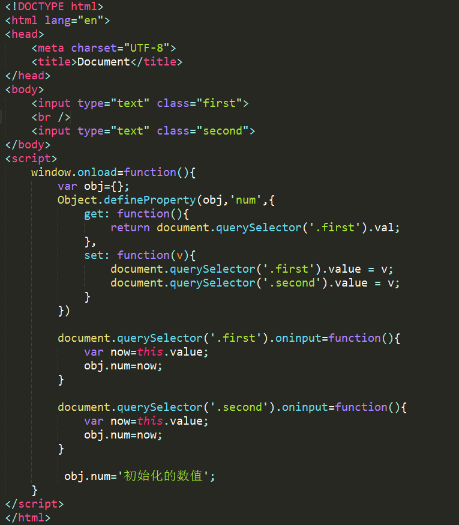

### 使用Object.defineProperty()实现双向数据绑定

Object.defineProperty()可以用来创建某一个对象的属性并进行设置,默认是false

    `
        var obj={};
        Object.defineProperty(obj,'num',{
            writable:true/false, //设置该属性是只读属性。不能修改
            Enumerable:true/false,//设置该属性是否可以被forin遍历
            Configurable:true/false,//设置该属性是否可以被delete删除
            value:val             // 属性的值
            get:  // 一个给属性提供 getter 的方法，如果没有 getter 则为 undefined。该方法返回值被用作属性值。undefined
            set://一个给属性提供 setter 的方法，如果没有 setter 则为 undefined。该方法将接受唯一参数，并将该参数的新值分配给该属性。默认为undefined。

        })
    `

使用set以及get可以实现双向数据绑定，get当属性被获取时触发get函数。set是当对象定义的属性值发生改变时会触发改函数

first 以及 second 的值发生改变时。触发obj.num的值改变，set方法会监听obj.num值的改变，当obj.num的值发生改变时，进行数值的同步以及保存。

